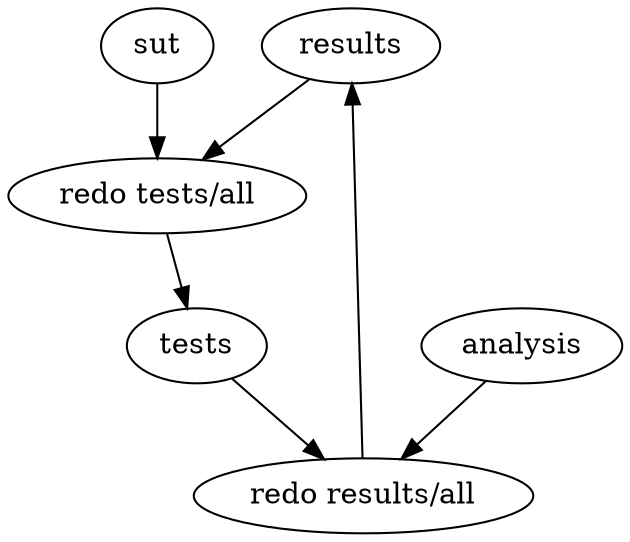

# Startup showdown

Repository for Startup Showdown; see [post][post.md].

## Structure

TL;DR run `./do` to build and run everything. Install a `redo` if
you want to do that more than once; commands listed with `redo` below can
be replaced by `./do` if you aren't into installing extra tools.

`sut/` has the system-under-test code. Each subdirectory holds a distinct test
case, i.e. binary to test.

`tests/` is the output directory for the tests. `redo tests/all-traces` to run
all tests. This automatically rebuilds the test inputs if needed.

`analysis` has the code for analyzing the test outputs to extract meaningful
numbers. `redo analysis/all` builds some summaries from the trace files.

