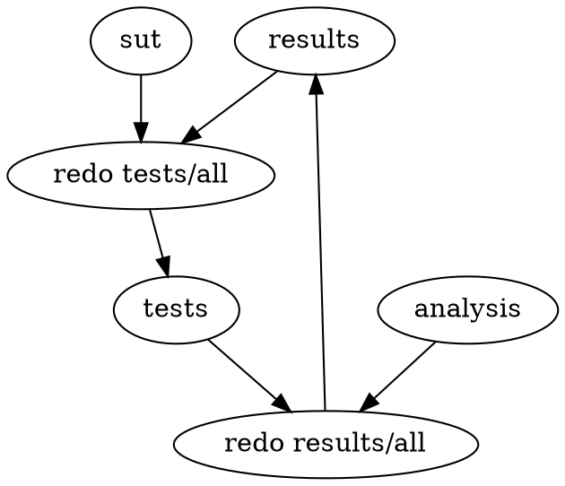

# Startup showdown

Repository for Startup Showdown; see [post][post.md].

## Structure

TL;DR run `./do.sh results/all` to build and run everything; install a `redo` if
you want to do that more than once.

`runner/` contains the code for the test executor. `redo runner/all` to rebuild.

`sut/` has the system-under-test code. Each subdirectory holds a distinct test
case, with a `sut.txtpb` file describing it to the test executor.

`tests/` is the output directory for the tests. `redo test/all` to run all
tests. This automatically rebuilds the runner if needed.

`analysis` has the code for analyzing the test outputs to extract meaningful
numbers. `redo analysis/all` rebuilds these tools.

`results/` presents the results of the analysis from the test data. `redo
results/all` to perform this analysis. This automatically rebuilds the
analizer if needed, and reruns the tests if needed.
